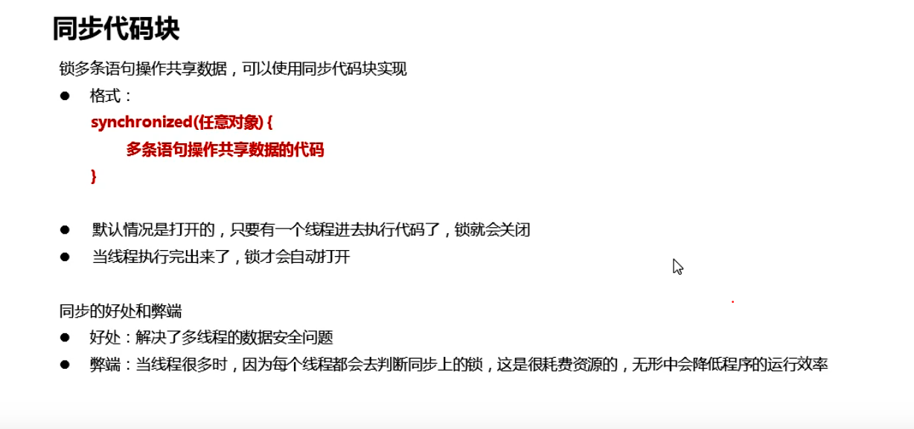

# Java多线程

# java多线程基础	

​	学习并发就像是学习全新的语言概念，而并发编程令人困惑的原因是使用并发的原因有多个，实现并发的方式也有多种，这两者之间美哦与明显的映射关系。

  	用并发解决的问题可分为**速度**和**设计可管理性**两种。并发通常是提高运行在单处理器上的程序性能。

​		Java 给多线程编程提供了内置的支持。 ==一条线程指的是进程中一个单一顺序的控制流==，一个进程中可以并发多个线程，每条线程并行执行不同的任务。 多线程能满足程序员编写高效率的程序来达到充分利用 CPU 的目的。

​		**进程:**是程序的一次动态执行，它对应着从代码加载，执行至执行完毕的一个完整的过程，是一个动态的实体，它有自己的生命周期。（独立性）

​       并发性：它可以和其他进程一起执行。

​	   它因创建而产生，因调度而运行，因等待资源或事件而被处于等待状态，因完成任务而被撤消。反映了一个程序在一定的数据 集上运行的全部动态过程。（动态性）通过进程控制块(PCB)唯一的标识某个进程。同时进程占据着相应的资源（例如包括cpu的使用 ，轮转时间以及一些其它设备的权限）。是系统进行资源分配和调度的一个独立单位。

 	  **线程:** 可以理解为进程的多条执行线索，每条线索又对应着各自独立的生命周期。线程是进程的一个实体,是CPU调度和分派的基本单位,它是比进程更小的能独立运行的基本单位。一个线程可以创建和撤销另一个线程，同一个进程中的多个线程之间可以并发执行。

​     单线程：**一个程序如果只有一条执行路径。

   **多线程：**一个进程如果有多条执行路径，则称为多线程。


**并发：**同一时刻有多个指令在==单个==CPU上==交替==执行。

**并行：**同一时刻，有多个指令在==多个==CPU上==同时==执行。

##    多线程实现方法（3种）

###   1.继承Thread


```java

public class mythread  extends Thread{

    @Override
    public void run() {
       for(int i=0;i<10;i++){
           System.out.println("线程开启了"+i);
       }
    }
}
```


执行：

```java
public class mythreadIm {

    public static void main(String[] args) {
        mythread t1=new mythread();
        mythread t2=new mythread();
        t1.start();
        t2.start();
    }

}

```

​    

为什么重写run（）

​			run（）里是对多线程实现代码的封装

  run（）和start（）区别

​       run只是调用多线程实现代码的封装，并没有开启多线程。

   start（）启动线程，然后由JVM调用此线程的run（）方法。


### 2.实现runnable接口


```java
public class Myrunnable implements Runnable{
    @Override
    public void run() {
        for (int i = 0; i < 10; i++) {
            System.out.println("第二种方法实现多线程"+i);
        }
    }
}

```

执行：

```java
public class myrunnableTest {
    public static void main(String[] args) {
        Thread t1=new Thread(new Myrunnable());
        t1.start();
        Thread t2=new Thread(new Myrunnable());
        t2.start();
    }
}

```


### 3.实现callable接口和Facture接口


```java

public class Mycallable implements Callable<String> {
    @Override
    public String call() throws Exception {
        for (int i = 0; i < 10; i++) {
            System.out.println("call方法实现");
        }
        return "成功";
    }
}
```

执行：

```java
public class mycalltest {

    public static void main(String[] args) throws ExecutionException, InterruptedException {
        Mycallable mc=new Mycallable();
        FutureTask<String> ft=new FutureTask<>(mc);
        Thread t1=new Thread(ft);

        t1.start();

        String s = ft.get();
        System.out.println(s);

    }

}
```


### Thread方法

获取线程名字 getname（）；线程有默认名字 格式：Thread-编号

线程设置名字：

   setname（）；

 构造方法；

获取当前线程对象：返回当前线程对象的引用

```java
public static native Thread currentThread();
```

线程休眠：指定时间为毫秒

```java
public static void sleep(long millis, int nanos)
    throws InterruptedException {
```


```java
 public static native void sleep(long millis) throws InterruptedException;
```


### 线程类型

后台线程（守护线程），普通线程

设置守护线程

```java
public final void setDaemon(boolean on) {
        checkAccess();
        if (isAlive()) {
            throw new IllegalThreadStateException();
        }
        daemon = on;
    }
```

当普通线程执行完毕之后，守护线程也会停止执行。

### 线程调度：


线程优先级只能建议cpu优先调度，无法保证。

### 线程生命周期


### 线程安全问题

当多个线程操作同一条数据时，可能出现安全问题。


```java

public class Ticket implements  Runnable{
   //定义票
    private static int ticket=100;

    @Override
    public void run() {
        while(true){
            if(ticket==0){
                break;
            }else{
                ticket--;
                System.out.println(Thread.currentThread().getName()+"在卖票，还剩下"+ticket);

            }
        }

    }
}
java

```

实现：

```java

public class tickettest {
    public static void main(String[] args) {
        Ticket ticket =new Ticket();
        //共享一个runnable
        Thread t1=new Thread(ticket);
        Thread t2=new Thread(ticket);
        Thread t3=new Thread(ticket);

        t1.setName("窗口一");
        t2.setName("窗口二");
        t3.setName("窗口三");
        t1.start();
        t2.start();
        t3.start();

    }

}

```


注意：输出是无顺序的。因为线程的输出是抢占的

#### 原因分析


相同票


​         由于线程睡眠，当他们往下走时会分别同步ticket

负数票


#### 同步代码块

  解决多线程操作共享数据的安全问题

 实现：把共享代码锁起来，让任意时刻只有一个线程可以使用。 JAVA中可以使用同步代码块的方式解决。并且锁对象唯一。


实现：

```java

public class Ticket implements  Runnable{
   private static int ticket=100;
    private  Object obj=new Object();

    @Override
    public void run() {
        while(true){
           synchronized (obj){ //注意多个线程要同一把锁
               if(ticket<=0){
                   break;
               }else{
                   try {
                       Thread.sleep(100);
                   } catch (InterruptedException e) {
                       e.printStackTrace();
                   }
                   ticket--;
                   System.out.println(Thread.currentThread().getName()+"在卖票，还剩下"+ticket);

               }
           }


        }

    }
}
```




#### 同步方法;

​    将synchronized加到方法上


==同步方法的锁是this==


#### 线程Lock


```java

public class Ticket implements Runnable {
    private static int ticket = 100;
    private Object obj = new Object();
    private ReentrantLock lock = new ReentrantLock();

    @Override
    public void run() {
        while (true) {
            //  synchronized (obj){ //注意多个线程要同一把锁
            try {
                lock.lock();

                if (ticket <= 0) {
                    break;
                } else {
                    try {
                        Thread.sleep(100);
                    } catch (InterruptedException e) {
                        e.printStackTrace();
                    }
                    ticket--;
                    System.out.println(Thread.currentThread().getName() + "在卖票，还剩下" + ticket);

                }

            } catch (Exception e) {
                e.printStackTrace();
            } finally {
                lock.unlock();
            }
            //}


        }

    }
}
```


#### 死锁

是指两个或者多个线程相互持有对方所需的资源，导致这些线程处于等待状态，无法前往执行。


### 生产者和消费者

  	生产者消费者模式并不是GOF提出的23种设计模式之一，23种设计模式都是建立在面向对象的基础之上的，但其实面向过程的编程中也有很多高效的编程模式，生产者消费者模式便是其中之一，它是我们编程过程中最常用的一种设计模式。

 		 在实际的软件开发过程中，经常会碰到如下场景：某个模块负责产生数据，这些数据由另一个模块来负责处理（此处的模块是广义的，可以是类、函数、线程、进程等）。产生数据的模块，就形象地称为生产者；而处理数据的模块，就称为消费者。

  	单单抽象出生产者和消费者，还够不上是生产者／消费者模式。该模式还需要有一个缓冲区处于生产者和消费者之间，作为一个中介。生产者把数据放入缓冲区，而消费者从缓冲区取出数据。大概的结构如下图。


==等待唤醒使用原因==：控制线程执行情况


实现：

生产者端：

```java

public class cooker  extends Thread{

    private task t;

    public cooker(task t) {
        this.t=t;
    }

    /*
    *  生产者步骤：
    * 1.判断桌子上是否有汉堡，有就等待，没有就唤醒生产
    * 2.把汉堡放桌上
    *3.唤醒消费者
    *
    *
    * */


    @Override
    public void run() {
        while (true){
            synchronized (t.getLock()){
                if(t.getCount()==0){
                    break;
                }else {
                    if(!t.isFlag()){
                        //没有开始生产
                        System.out.println("cooker生产");
//                        task.flag=true;
                        t.setFlag(true);

                        //唤醒
//                        task.lock.notifyAll();
                        t.getLock().notifyAll();
                    }else{
                            //有
                        try {
                          //  task.lock.wait();
                            t.getLock().wait();
                        } catch (InterruptedException e) {
                            e.printStackTrace();
                        }
                    }
                }

            }
        }
    }
}

```

消费者端

```java
public class foodie extends Thread {

    private task t;

    public foodie(task t) {
        this.t=t;
    }

    /*
     *  生产者步骤：
     * 1。判断桌子上是否有汉堡
     * 2.没有就等待
     * 3.有就开吃
     * 4.吃完之后，叫醒等待的生产者。
     * 5.汉堡总数减一
     *
     * */

    @Override
    public void run() {
        //多次吃
        while (true) {
//            同一把锁
            synchronized (t.getLock()) {
                //吃完汉堡
                if (t.getCount() == 0) {
                    break;
                } else {
                    //吃汉堡
                    if (t.isFlag()) {
                        //有

                        // 有就开吃
                        System.out.println("foodie吃汉堡");
//                        task.flag=false;
                        t.setFlag(false);
                        //4.吃完之后，叫醒等待的生产者。
//                        task.lock.notifyAll();
                        t.getLock().notifyAll();
                        //5.汉堡总数减一

                       // task.count--;
                        t.setCount(t.getCount()-1);
                    } else {
                        //没有就等待
                        //使用什么对象当锁，就必须用这个对象去调用等待和唤醒的方法
                        try {
//                            task.lock.wait();
                            t.getLock().wait();
                        } catch (InterruptedException e) {
                            e.printStackTrace();
                        }
                    }
                }
            }
        }
    }
}

```


桌面控制端：

```java

public class task {

    /*
    * 控制生产者消费者线程
    * 定义一个标记，
    * false表示桌子上无汉堡，唤醒生产者
    * true 表示桌子上有汉堡，叫醒消费者
    *
    * */
   // public static boolean flag=false;
    private boolean flag;


    //定义汉堡总数
    //public static int count=10;
   private int count;
    //定义锁
   // public static  final Object lock=new Object();

    private final  Object lock=new Object();

    public task() {
        this(false,10);
    }

    public task(boolean flag, int count) {
        this.flag = flag;
        this.count = count;
    }


    public boolean isFlag() {
        return flag;
    }

    public void setFlag(boolean flag) {
        this.flag = flag;
    }

    public int getCount() {
        return count;
    }

    public void setCount(int count) {
        this.count = count;
    }

    public Object getLock() {
        return lock;
    }

    @Override
    public String toString() {
        return "task{" +
                "flag=" + flag +
                ", count=" + count +
                ", lock=" + lock +
                '}';
    }
}

```

案例端：

```java
public class demo {

    public static void main(String[] args) {
      task t=new task();

        cooker c=new cooker(t);
        foodie f=new foodie(t);
        c.start();
        f.start();
    }
}

```

